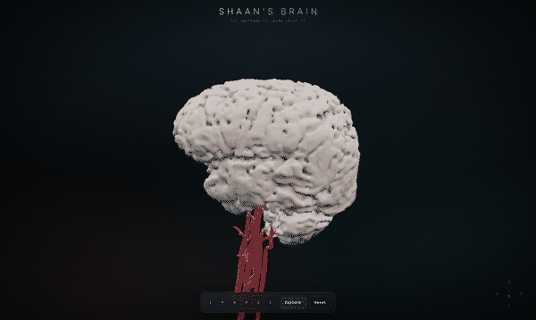
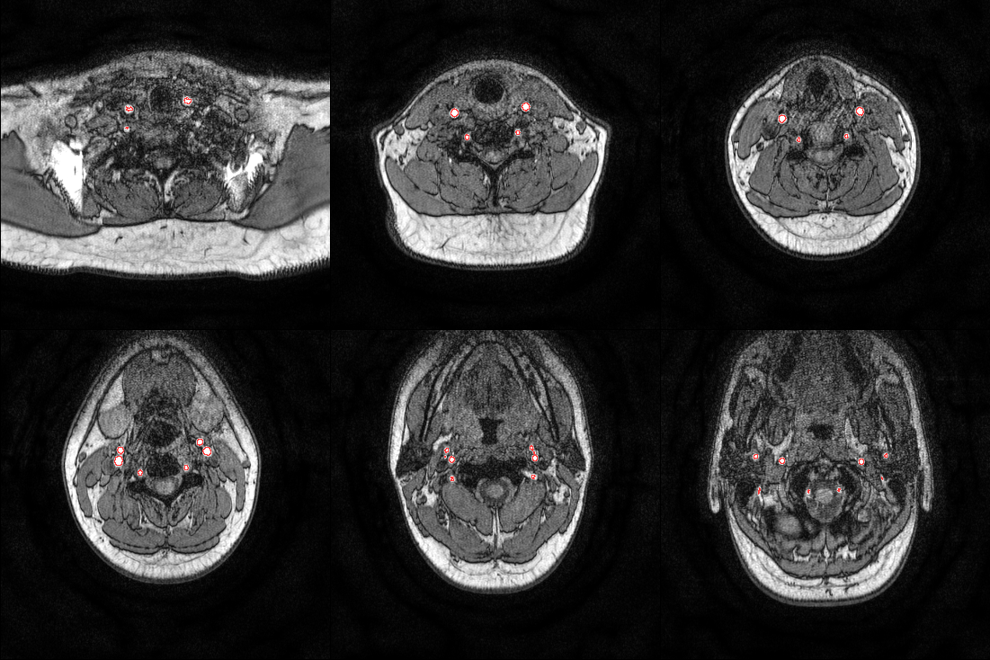
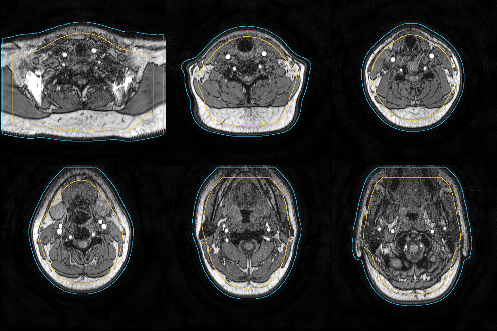
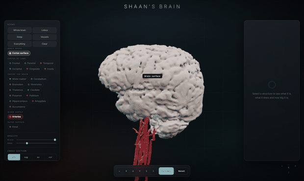
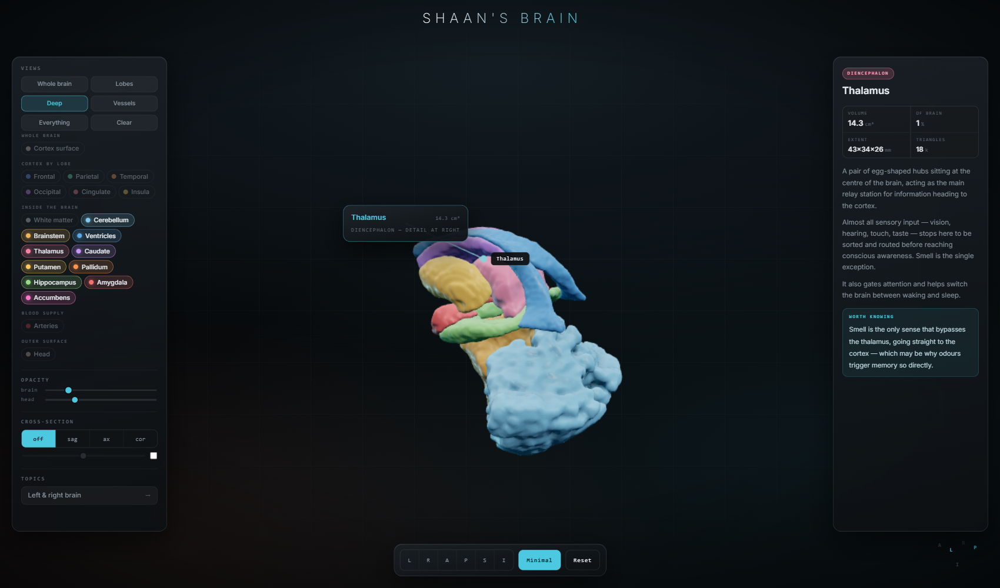
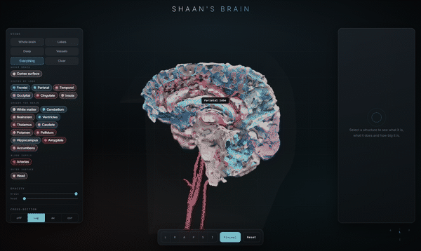
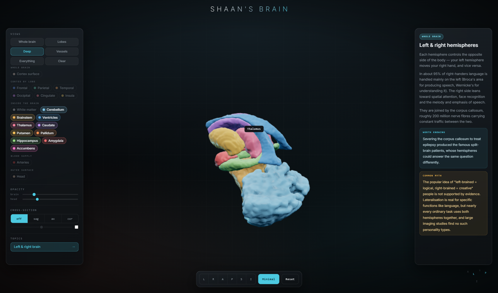
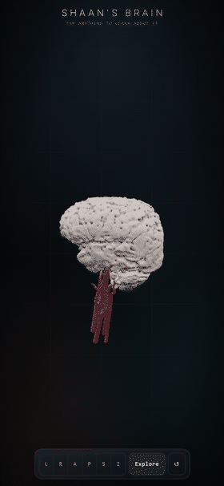

# Shaan's Brain

I had an MRI in October 2023. Two years later I found the disc in a drawer,
got curious about whether there was a real 3D model hiding inside those files,
and went looking.

There was.



Twenty separately selectable structures covering 95.4% of the brain by volume.
Click any of them and it tells you what it is, what it does, and how big it is.

---

## Contents

- [What I started with](#what-i-started-with)
- [Finding a series that could actually work](#step-1--finding-a-series-that-could-actually-work)
- [Getting a brain out of it](#step-2--getting-a-brain-out-of-it)
- [Carving the folds back open](#step-3--carving-the-folds-back-open)
- [The arteries](#step-4--the-arteries)
- [Two scans, two coordinate systems](#step-5--two-scans-two-coordinate-systems)
- [The head](#step-6--the-head)
- [Naming every part](#step-7--naming-every-part)
- [Faking the light properly](#step-8--faking-the-light-properly)
- [The viewer](#the-viewer)
- [Making it fast](#making-it-fast)
- [Everything that went wrong](#everything-that-went-wrong)
- [Running it yourself](#running-it-yourself)
- [What the numbers actually mean](#what-the-numbers-actually-mean)

---

## What I started with

A Philips Achieva 1.5 T scanner produced two studies on the same morning:

| Time | Study | What's in it |
|---|---|---|
| 09:11 | C-SPINE | Neck spine images, plus a 3D angiogram of the arteries in my neck |
| 12:16 | BRAIN | FLAIR, diffusion, T1, T2, and SWI |

2,430 DICOM files across 72 series. I converted everything with `dcm2niix` and
worked from the NIfTI output.

Here is the thing nobody tells you before you start: a clinical brain scan is
not built for this. Every tutorial you find online assumes a 3D T1 MPRAGE,
1 mm isotropic, 180+ slices, because that is what FreeSurfer and the rest of
the neuroimaging world runs on. Hospitals skip it. Radiologists read slices,
not volumes, so they order thick slices that look sharp on screen.

Every brain series in my scan is **5 mm thick with a 0.5 mm gap**. Thirty
slices for an entire head. You cannot build a surface from that. It is like
trying to sculpt someone's face from thirty photographs taken 5 mm apart.

So before anything else, I had to find out whether the scan contained anything
three-dimensional at all.

## Step 1 : Finding a series that could actually work

I ignored the series descriptions and measured the real voxel geometry of every
one of them. Two jumped out.

| Series | In-plane | Slice thickness | Slices | Verdict |
|---|---|---|---|---|
| FLAIR, T1, T2 | 0.24 to 0.44 mm | **5.0 mm** | 30 | gorgeous in-plane, useless in depth |
| **SWI / VEN_BOLD** | 0.60 mm | **1.5 mm** | **101** | the only near-3D brain volume |
| **s3DI_MC (angiogram)** | 0.34 mm | **0.75 mm** | **276** | sharpest volume in the whole dataset |

The susceptibility-weighted series is the reason this project exists at all.
It gets acquired as a thin-slice 3D gradient echo to look for microbleeds.
Nobody intends it as an anatomical volume. But at 0.6 x 0.6 x 1.5 mm it was
the one brain series with enough depth resolution to mesh, and it was sitting
there the whole time.

The angiogram is even sharper, but time-of-flight imaging deliberately
suppresses everything that isn't moving, so it contains blood and almost
nothing else.

## Step 2 : Getting a brain out of it

I assumed I would need a neural network for brain extraction, and started
looking at which one to install. I didn't need one, because of a lucky quirk of
the contrast: on SWI the skull is a dark shell that already separates brain
from scalp. A threshold plus some morphology gets most of the way.

What `pipeline/01_brain.py` does:

1. Resample to 0.8 mm isotropic. Marching cubes on an uneven grid produces
   visible terracing along the thick axis, and resampling first is what kills
   it.
2. Multi-Otsu with four classes. The second boundary separates brain tissue
   from CSF and bone.
3. **Erode hard**, then keep only the largest connected blob. The erosion snaps
   the few remaining bridges through the eye sockets and skull base, and
   whatever survives is unambiguously the brain.
4. **Grow it back** into the thresholded tissue, but bounded, so it can reclaim
   real tissue without flooding through the skull into the scalp.
5. Close and fill.


Blue is the smooth envelope, red is the final surface. The contour hugs the
temporal lobes and cerebellum, which is exactly where threshold methods usually
fall apart, so this was the first sign it was going to work.

The envelope came out at 1348 cm³, a completely plausible adult brain. That was
the moment I believed the whole thing was possible.

## Step 3 : Carving the folds back open

The mask from step 2 is a smooth bag. It bridges straight over every fold, so
the first mesh looked like a peeled potato. Recognisably a brain. Completely
bald.

The fix uses the same contrast trick a second time. **CSF is dark on SWI**, and
every sulcus is full of CSF, so re-thresholding *inside* the envelope carves
the folds back open.

Picking that threshold mattered more than I expected, so I swept it and looked
at every result:

| Cut | Volume | What it looked like |
|---|---|---|
| p8 | 1241 cm³ | still bald |
| p10 | 1214 cm³ | a hint of texture |
| **p13** | **1173 cm³** | **real gyri, surface still intact** |
| p16 | 1132 cm³ | good relief, cortex getting thin |
| p20 | 1078 cm³ | falling apart into crumbs |

I settled on the 13th percentile of intensity inside the envelope, expressed as
a percentile rather than a fixed number so it adapts to how bright the scan is.


One detail cost me an hour. Out of pure habit I followed the threshold with
`binary_closing` and `fill_holes`. Both of them reseal the exact folds the
threshold just opened. The volume barely moved, 2.61 M voxels against 2.63 M,
so every number I was printing looked fine while the render was obviously
wrong. There is a comment in the code now telling future me not to put them
back.

## Step 4 : The arteries

Time-of-flight angiography makes flowing blood far brighter than everything
around it, so a high threshold finds the arteries immediately. It also finds
subcutaneous fat, which is just as bright, and there is a lot of fat in a neck.



The small bright dots deep in the middle are the real arteries. Everything
tracing the outline of the neck is fat. Three filters separate them:

**How deep it sits.** Fat lives in a shallow rim just under the skin. The
carotids and vertebrals run 25 to 40 mm deep. So I build a solid silhouette of
the neck, compute distance from the outside air, and demand at least 14 mm.

This took two attempts. My first silhouette was a plain tissue threshold, which
comes out speckled, because muscle and bone fall below the cut and leave dark
channels running all the way out to the air. That wrecks the distance
transform: only 1.7 M of 19 M voxels came back as "deep", and the filter
cheerfully deleted the arteries along with the fat. Blurring hard *before*
thresholding makes the interior solid and fixes it.



**How elongated it is.** Run PCA on each blob's voxel cloud. A tube puts nearly
all of its variance on one axis.

**How flat it is.** This one caught me out. A slab of fat is elongated too, just
along *two* axes instead of one, so it sails through the elongation test.
Demanding that the second principal axis be under 16% of the first is what
finally cleared out the last stubborn clumps.


Both carotids with their bifurcations, both carotid siphons curling at the base
of the skull, both vertebral arteries. 10.2 cm³ of vessel, and genuinely my
favourite object in the whole project.

## Step 5 : Two scans, two coordinate systems

The brain comes from the 12:16 study and the arteries from the 09:11 one. Three
hours apart means I got off the table and was repositioned, so identical
scanner coordinates absolutely do not mean identical anatomy. Rendered together
in raw scanner space, my carotid siphons floated a couple of centimetres away
from the skull base they are supposed to hug.

`pipeline/02b_align_arteries.py` rigidly registers the angiogram onto the SWI
with ANTs, restricted to the slab where the two overlap so the non-shared neck
and vertex can't drag the fit off course.

Then a second problem appeared. Warping straight into the SWI grid cropped the
carotids at the edge of the head field of view and threw away most of their
length, 58 k voxels down to 14 k. So the output now goes into a union grid:
SWI orientation, so the arteries land in the brain's frame, but extended far
enough down to keep the whole neck.


## Step 6 : The head

Neither series covers a whole head. The SWI is 233 mm wide but its field of
view slices straight through the face. The sagittal T1 has the entire profile,
nose and chin included, but is only 144 mm across.

They come from the same session, so they already share a coordinate frame, and
`pipeline/03_head.py` simply unions the two silhouettes. SWI gives the width
and the skull vault, sagittal T1 gives the face.


The head is **defaced** by default. Everything in front of the frontal lobe and
below eye level gets flattened away. A 3D face reconstructed from MRI is
biometric data, and it can be matched against a photograph, so the unmodified
version is opt-in via `--keep-face`, writes only into the git-ignored `build/`
folder, and never becomes a mesh.

## Step 7 : Naming every part

This is the step that turns a nice-looking blob into something you can learn
from.

I warp the **Harvard-Oxford atlases** onto my scan using ANTs SyN registration
and let the labels ride along. Doing it this way means every named region
traces back to a published atlas instead of to a boundary I drew by eye.

The registration is cross-modality, since the atlas template is T1-weighted and
my scan is SWI, so it runs on mutual information over brain-extracted volumes.


The ventricles, thalamus, caudate, putamen, hippocampus and brainstem contours
all land on the real structures, which is the only check that matters.

**The cortex problem.** My first version used only the subcortical atlas, and
when I switched the layers on, the result covered a small fraction of the
brain. The entire cerebral cortex was unlabelled, which is to say most of it.
Harvard-Oxford ships as two separate atlases and I had only warped one of them.

So the second version warps the cortical atlas too: 48 regions, which I group
into lobes with an ordered set of matching rules. Order matters. "Temporal
Occipital Fusiform Cortex" has to be matched before the plain "occipital" rule
or it ends up in the wrong lobe entirely. The script prints anything it fails
to assign, which is how I caught "Parietal Opercular Cortex" quietly slipping
through on the first run.

**The cerebellum** has no Harvard-Oxford label at all, which surprised me. I
derive it as the one large unlabelled blob left inside the brain mask once
everything else is accounted for, eroding first to shed the thin unlabelled CSF
rim that clings to the whole surface.

Final tally, twenty parts covering **95.4% of the brain by volume**:

| Group | Structures |
|---|---|
| Cortex by lobe | frontal, parietal, temporal, occipital, cingulate, insula |
| Inside | white matter, cerebellum, brainstem, ventricles, thalamus, caudate, putamen, pallidum, hippocampus, amygdala, accumbens |
| Other | whole cortical surface, arteries, head |

The volumes all land in normal adult ranges: brain 1173 cm³, white matter
295 cm³, cerebellum 106 cm³, ventricles 11.1 cm³, brainstem 27.9 cm³.

## Step 8 : Faking the light properly

A single-colour organic surface renders flat and plasticky. Screen-space
ambient occlusion would fix it, at the cost of a postprocessing pass and
several more dependencies.

So instead I compute ambient occlusion **from the volume itself** and bake it
into the vertex colours. Blur the binary mask, then sample it at every vertex.
Deep in a fold you are walled in on all sides, so the blurred value is high. On
top of a ridge it is low. That maps directly onto how dark the crevice should
be, costs a single convolution, and needs nothing at runtime beyond a colour
attribute.

This one change did more for how the model looks than everything else combined.

`pipeline/05_export.py` then smooths each mask with Taubin lambda/mu smoothing,
which avoids the shrinkage plain Laplacian smoothing causes and would visibly
thin the gyri, decimates to a triangle budget, and writes GLB.

One coordinate detail worth writing down: scanner space is RAS and glTF is
Y-up, so vertices get mapped `(x, y, z)` to `(x, z, -y)`. That is a
right-handed transform with determinant +1. A left-handed one would silently
mirror the model and swap my left and right hemispheres, which is the kind of
bug you don't notice until it really matters.

## The viewer

`web/` is a three.js app with no build step and no CDN. three.js and
three-mesh-bvh are vendored into `web/vendor/`, so the whole thing runs
offline.

### Two modes

**Minimal** is the default. The model, a centred bar, the compass, nothing
else. Click any structure and a leader line runs from the exact point you
touched out to a card telling you what it is.


**Explore** brings in a symmetric pair of panels, layers on the left and detail
on the right, so the layout stays balanced instead of leaning to one side. In
this mode the callout shrinks down to just a label on the end of the leader,
because repeating the same paragraphs over the model was only covering it up.



The right panel is where the detail lives: which anatomical system it belongs
to, volume, its share of the whole brain, physical size in millimetres,
triangle count, what it does, and one thing worth knowing about it.



Layers are **chips, not switches**. Click to toggle, double-click to isolate,
hover to light it up in 3D. Above them, a row of Views sets a whole scene in
one click, because arranging twenty chips by hand to get somewhere sensible is
tedious and the useful combinations are predictable. *Deep* also fades the
cortex for you, and deliberately leaves white matter off, since white matter is
a big opaque shell wrapped around precisely the structures that view exists to
show.

There is a cross-section that cuts a plane through everything at once:



And a topic card on hemispheres, covering contralateral control, language
lateralisation and the corpus callosum. It also flatly calls the
"left-brained / right-brained personality" idea unsupported, since that is the
version most people have actually heard:



A few other things it does: fly the camera right inside the brain, double-click
a structure to focus on it, jump to anatomical preset views, and drift into a
slow orbit after five seconds of being left alone.

### On a phone

The panels turn into bottom sheets sitting above the bar, one at a time, with
38 px touch targets.



The floating callout docks to the bottom, because a card tethered to a line is
unreadable at that size. On a phone that card is the only detail surface, so it
carries everything: description, stats, the fact. The camera also frames wider
so the model stays clear of it.

The bar needed real work. Six view buttons plus three controls overflowed a
390 px screen and pushed the last ones clean off the edge of the viewport,
where they could not be tapped at all. The segment tightens and Reset collapses
to its glyph.

## Making it fast

`npm run bench` drives the viewer on a real GPU and reports frame times, draw
calls and picking cost. On an AMD Radeon integrated GPU at 1600 x 950:

| Scene | Before | After |
|---|---|---|
| Brain only | 59.9 fps | 59.9 fps (vsync cap) |
| Default | 59.9 fps | 59.9 fps (vsync cap) |
| Lobes | n/a | 59.9 fps |
| Deep | n/a | 59.9 fps |
| Everything on | 28.6 fps | **59.9 fps** |
| Everything, close-up | 14.5 fps | **48.3 fps** |
| Raycast per pick | 43.4 ms | **0.427 ms** |

"After" is measured with twenty parts and 1.4 M triangles on screen, roughly
double the geometry of the "before" column. **Not one triangle was removed.**

What actually mattered:

**Picking was the worst offender by miles.** Hover raycasting was brute-force
testing every triangle of every visible mesh on every single `pointermove`.
1.3 M triangles, 43 ms per event, on an input that fires faster than the screen
refreshes. A BVH made it about a hundred times faster. Raycasts are now also
coalesced to one per frame and skipped entirely while you are dragging, since
the answer would be thrown away anyway.

**Everything was permanently flagged `transparent`,** even at full opacity.
That dumped every nested shell into the sorted blend pass with no early-Z
rejection. Opaque parts render opaque now, which is what halved the draw calls.

**Clearcoat and sheen get dropped below 50% opacity.** A second specular
highlight you cannot possibly see through a 22%-opaque surface is pure wasted
cost. The scalp, which is a full-screen near-transparent shell and was the most
expensive single thing on screen in the close-up case, dropped to a plain
standard material entirely.

**Adaptive resolution** as a safety net. The framebuffer scale steps down when
frame time stays above 24 ms and recovers when it drops. Pixels only, never
geometry.

## Everything that went wrong

Beyond the ones above, four were interesting enough to be worth writing down.

### The cortex went hollow

I switched materials to `FrontSide` so the GPU could cull back faces. Free
performance, obviously. It benchmarked beautifully, 60 fps with everything on.
It also did this:


These meshes come from marching cubes on a **non-watertight** mask, and their
triangle winding is mixed. Culling deleted every inward-facing triangle,
punching holes straight through my cortex. Measuring it afterwards was
illuminating: the head is 99% correctly wound and watertight, and rendered
perfectly. The brain is neither. `trimesh.fix_normals()` changes nothing at
all, because it cannot orient a mesh that isn't watertight in the first place.

`side` is pinned to `DoubleSide` now with a comment explaining exactly why.
Making the meshes watertight in the pipeline would unlock it properly, and
would also make them 3D-printable, since watertightness is precisely what
slicers demand.

### Everything rendered as a black silhouette

Geometry loaded, shape was right, every mesh pure black. The GLB files had no
`NORMAL` attribute, so every lit material had nothing to shade with. Fixed at
both ends: `include_normals=True` on export, and a `computeVertexNormals()`
fallback on load.

### The leader lines were invisible

My first callout pushed its label away from the surface **along the surface
normal**. That looks perfect in profile, and collapses to exactly zero screen
length whenever the normal happens to point at the camera. Which is most of the
time, because you tend to click the thing facing you. The leader is routed in
screen space now, so it always has visible length whichever way the model is
turned.

### Evans' index, three wrong answers in a row

Evans' index is a ratio of ventricle width to skull width, and it is normally a
single caliper measurement a radiologist makes on one chosen slice. Automating
it produced three confident, plausible, completely wrong numbers before I got
one I trusted:

1. **0.325.** Ventricles segmented from SWI using "dark means CSF". Wrong,
   because on SWI the *veins* are the darkest thing in the brain, so it traced
   blood vessels and sulci.
2. **0.607.** Ventricles from T2 this time, where CSF is unmistakable, but
   maximising the *ratio* across slices. That just finds a slice where the
   denominator is degenerate. It reported 7.9 mm ventricles inside a 13.1 mm
   skull.
3. **0.313.** Slice picked by widest frontal horn, denominator taken globally.
   Closer, except the "frontal horns" it found were in the posterior fossa. It
   had measured the fourth ventricle.
4. **0.194.** Atlas used to identify the *lateral* ventricles specifically, T2
   intensity for the actual boundary, frontal horns taken as the front 45% of
   their own extent.

Any of the first three would have read as a real finding. The only reason I
caught them is that I rendered the exact slice each measurement came from and
looked at it. That is the whole lesson of this project in one line: a number
from an automated pipeline is worth nothing without a picture of what it
measured.

## Running it yourself

```bash
npm install     # three.js and three-mesh-bvh
npm run serve   # http://localhost:8080
```

It has to be served over http. ES modules and `fetch()` do not work from
`file://`.

**Controls:** drag to orbit, scroll to zoom, click a structure to read about
it, double-click to focus, `E` toggles Explore, `Esc` clears.

### Deploying

It is a folder of static files, so any static host works. There is no server
code, no build step and no API.

Cloudflare Pages: connect the repo, leave the build command empty, set the
build output directory to `web`. `web/_headers` sets the cache lifetimes.

The only thing worth checking after a deploy is whether the host compresses
the geometry. GLB gzips by about 40% (25.3 MB down to 15.3 MB across the
twenty models), but `model/gltf-binary` is not on every CDN's compressible
list, because it is usually assumed to be Draco-compressed already:

```bash
curl -sI -H 'Accept-Encoding: gzip, br' https://<host>/models/brain.glb | grep -i content-encoding
```

No `content-encoding` header back means that 40% is being left on the table.

### Rebuilding from the scan

The DICOM is deliberately not in this repo. Point the scripts at a folder of
`dcm2niix` output and run them in order:

```bash
python pipeline/01_brain.py            # brain mask and cortical surface
python pipeline/02_arteries.py         # arterial tree from the angiogram
python pipeline/02b_align_arteries.py  # register the angiogram onto the brain
python pipeline/03_head.py             # head surface (--keep-face skips defacing)
python pipeline/04_deep.py             # atlas registration, named structures
python pipeline/05_export.py           # AO bake, decimate, write GLB
```

Needs `numpy scipy scikit-image nibabel trimesh fast-simplification antspyx nilearn`.

Every script drops a QC image into `build/`. Look at those, not just the
console output. Almost every mistake in this project produced perfectly
reasonable numbers and an obviously wrong picture. `04_deep.py` caches its
registration, so pass `--force` when you want it redone.

## What the numbers actually mean

Not every part of this model is the same kind of thing, and the difference
matters if you are reading the volumes.

**Measured from the scan.** The brain surface, the arteries, the head. Every
vertex traces back to voxel intensities in the DICOM.

**Positioned from the scan, shaped by an atlas.** The lobes, white matter, all
the deep nuclei. These are Harvard-Oxford structures elastically warped onto my
anatomy. Their *location* comes from my scan; their *shape* is largely
inherited from the template. So the volumes shown for them are closer to "the
atlas structure after warping" than to an independent measurement of me. Lobe
boundaries especially are a convention, not something visible in the tissue.

**Worked out by subtraction.** The cerebellum is whatever the atlases did not
label. At 105.9 cm³ against a typical 120 to 160 cm³, it is probably
under-segmented.

**Chosen, not measured.** Every colour, and the smoothing. Taubin smoothing and
the pre-mesh blur genuinely move the surface, so this is a smoothed likeness
rather than a millimetre-exact cast.

And the brain volume itself is threshold-dependent. It moves between 1078 and
1241 cm³ across reasonable choices of that cortical cut, which is worth
remembering before comparing it against anything.
