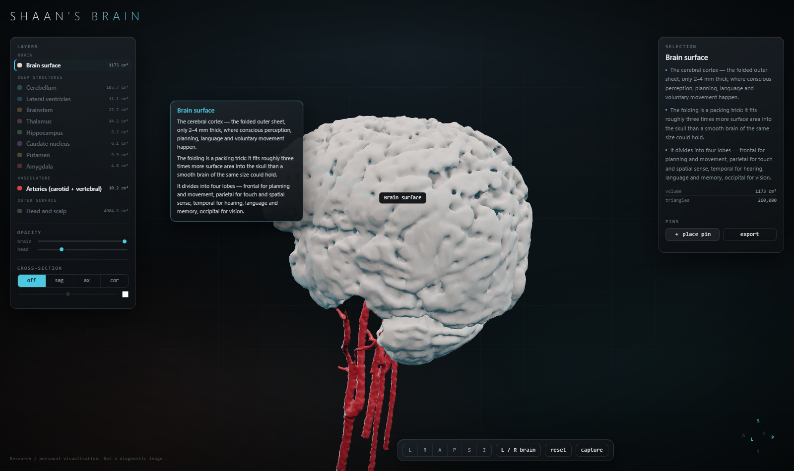
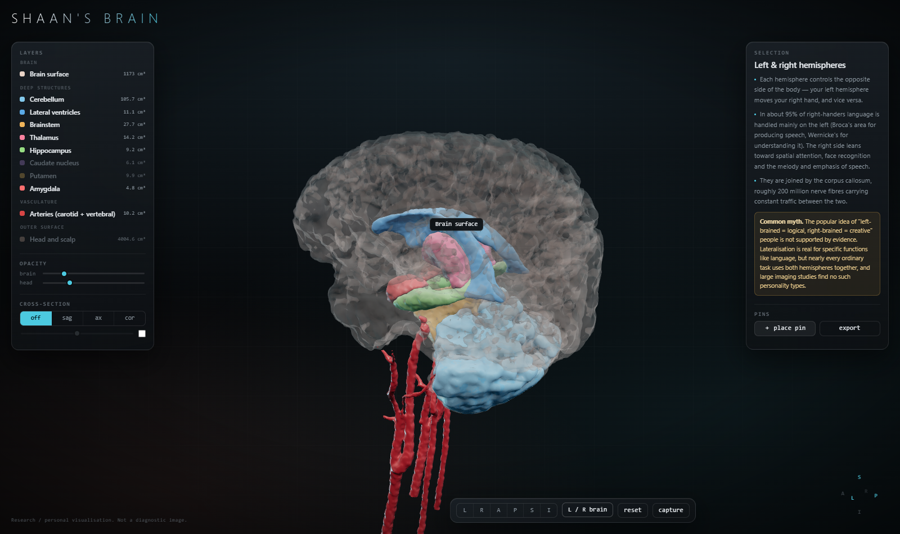
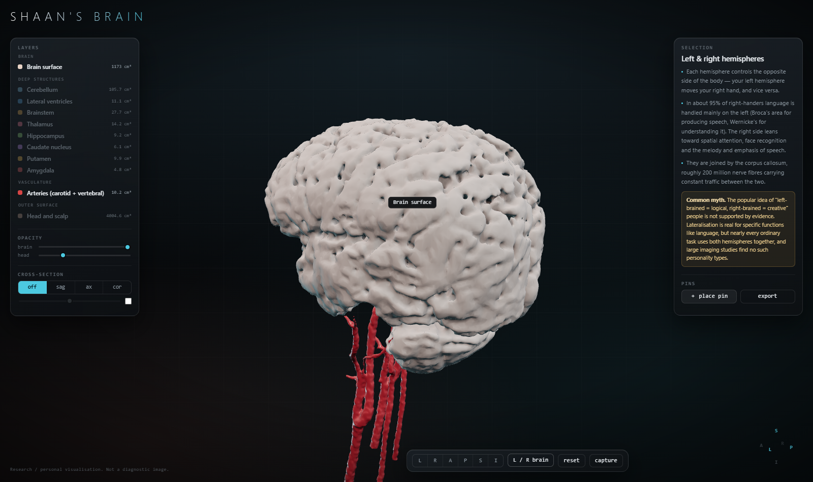

# brain

An interactive 3D model of my own brain, reconstructed from a diagnostic MRI
taken on 2023-10-07 (Philips Achieva 1.5 T), and a small web viewer for it.



| Deep structures | Cross-section |
|---|---|
|  |  |

## What is in the model

| Part | Source series | Method |
|---|---|---|
| Brain surface | SWI / VEN_BOLD, 0.60 × 0.60 × 1.50 mm | threshold + morphology |
| Arteries | 3D TOF MRA, 0.34 × 0.34 × 0.75 mm | bright-blood threshold + shape filters |
| Cerebellum | derived | brain minus all atlas-labelled cerebrum |
| Ventricles, brainstem, thalamus, hippocampus, caudate, putamen, amygdala | SWI | Harvard-Oxford atlas warped on with ANTs SyN |
| Head / scalp | SWI + T1 sagittal | fused outer silhouette, **defaced** |

## What is measured and what is inferred

Worth being precise about, because the parts are not equally trustworthy.

**Measured from the scan.** The brain surface, the arteries and the head. Every
vertex traces back to voxel intensities in the DICOM.

**Positioned from the scan, shaped by an atlas.** Thalamus, hippocampus,
caudate, putamen, amygdala, brainstem, ventricles. These are Harvard-Oxford
atlas structures elastically warped onto this brain. Their *location* is
inferred from this anatomy; their *shape* is substantially inherited from the
template. The volumes quoted for them are therefore closer to "the atlas's
structure after warping" than to an independent measurement of this subject.
Treat them as well-placed labels, not as morphometry.

**Derived by subtraction.** The cerebellum is whatever the atlas did not label
inside the brain mask. At 105.7 cm³ against a normal 120–160 cm³ it is
probably under-segmented.

**Invented outright.** Every colour. And the smoothing: Taubin smoothing plus
the pre-mesh blur genuinely move the surface, so this is a smoothed likeness,
not a millimetre-exact cast.

The measured volumes do land in normal adult ranges (brain 1173 cm³,
ventricles 11 cm³, brainstem 28 cm³), which is the main sanity check that the
segmentation is not wildly off.

## Running the viewer

```bash
npm install     # three.js only
npm run serve   # http://localhost:8080
```

It must be served over http — ES modules and `fetch()` do not work from
`file://`.

**Controls:** drag to orbit, scroll to zoom (you can go right inside the
brain), click a structure to draw a leader line out to a card explaining what
it does, double-click to focus it, click a layer row to toggle it. `L / R
brain` explains hemispheric specialisation. `＋ place pin` then click the model
to drop a labelled marker; `export` downloads `pins.json`, which you can drop
back into `web/` to make the pins permanent. The cross-section buttons cut a
sagittal, axial or coronal plane through everything at once.

### About the descriptions

The functional summaries in `web/anatomy.json` are standard textbook
neuroanatomy, written to be readable rather than exhaustive — they describe
what each structure characteristically does, not what this particular brain
does. The hemispheres card deliberately includes the "left-brained /
right-brained personality" myth, because functional lateralisation is real and
the personality claim built on top of it is not.

## Rebuilding from the raw scan

The DICOM is deliberately **not** in this repo (see below). Point the scripts
at a folder of dcm2niix output and run them in order:

```bash
python pipeline/01_brain.py           # brain mask + cortical surface
python pipeline/02_arteries.py        # arterial tree from the angiogram
python pipeline/02b_align_arteries.py # rigid registration onto the brain scan
python pipeline/03_head.py            # scalp surface + defaced variant
python pipeline/04_deep.py            # atlas registration -> named structures
python pipeline/05_export.py          # decimate + write GLB and manifest.json
```

Requires `numpy scipy scikit-image nibabel trimesh fast-simplification antspyx nilearn`.
Every script writes a QC image into `build/` — look at those, not just the
console output. `04_deep.py` caches its registration; pass `--force` to redo it.

### Two things worth knowing

**The brain and the arteries come from different studies.** The angiogram was
acquired at 09:11 and the brain scan at 12:16, with the subject repositioned in
between, so identical scanner coordinates do not mean identical anatomy.
`02b_align_arteries.py` rigidly registers one onto the other; without it the
carotid siphons float centimetres away from the skull base.

**There is no 3D T1 in this scan.** Clinical brain protocols use 5 mm slices,
which cannot make a surface. The SWI series happens to be 1.5 mm and is the
only reason any of this works. The cortical detail here is therefore softer
than a FreeSurfer reconstruction from a research MPRAGE — that is a limit of
the source data, not of the pipeline.

**No single series covers the whole head.** The SWI is 233 mm wide but its
field of view cuts straight through the face; the sagittal T1 has the entire
face profile and chin but is only 144 mm across. `03_head.py` unions the two
silhouettes — same session, so they already share a coordinate frame. The
profile is faithful; front-on, the face is squared off at the edges of the
sagittal slab, and its 5.3 mm slice spacing shows as fine terracing across the
cheeks. Neither is fixable without a scan that was acquired for the purpose.

## Privacy

The source DICOM carries full patient identifiers (name, ID, date of birth,
institution) and lives **outside this repository** on purpose, with `.gitignore`
as a second line of defence.

A 3D face reconstructed from MRI is biometric data — it can be matched against
a photograph. **The head model is therefore defaced by default**: everything in
front of the frontal lobe and below eye level is flattened away, leaving the
vault and the back of the head. That is the only head mesh the viewer loads and
the only one in this repo.

The unmodified version is opt-in via `python pipeline/03_head.py --keep-face`,
which writes `build/head_identifiable_mask.nii.gz`. That path is git-ignored,
`05_export.py` never reads it, and no `.glb` is produced from it — so the real
face cannot reach the web build by accident.

Not a diagnostic tool. Nothing here has been read by a radiologist.
