# Shaan's Brain

An interactive 3D reconstruction of my own brain, built from a diagnostic MRI
I had taken on 7 October 2023, and a viewer for exploring it in the browser.

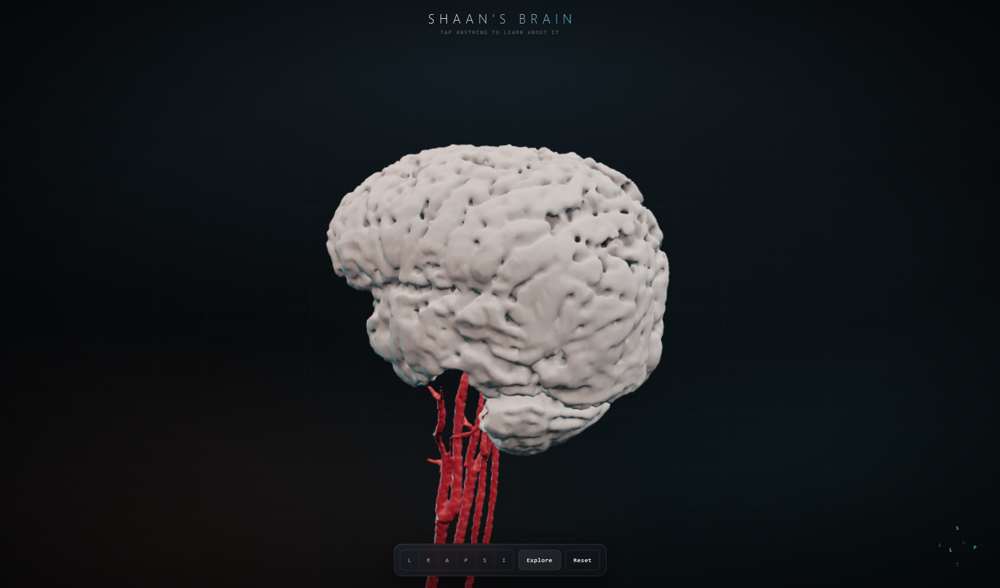

Twenty separately selectable structures covering 95.4% of the brain by volume.
Click any of them and it tells you what it is, what it does and how big it is.

---

## Contents

- [What I started with](#what-i-started-with)
- [Choosing a series](#step-1--choosing-a-series)
- [Getting a brain out of it](#step-2--getting-a-brain-out-of-it)
- [Carving the sulci back open](#step-3--carving-the-sulci-back-open)
- [The arterial tree](#step-4--the-arterial-tree)
- [Two studies, two coordinate frames](#step-5--two-studies-two-coordinate-frames)
- [The head](#step-6--the-head)
- [Naming every part](#step-7--naming-every-part)
- [Baking the light in](#step-8--baking-the-light-in)
- [The viewer](#the-viewer)
- [Performance](#performance)
- [Problems I hit](#problems-i-hit)
- [Running it](#running-it)
- [What the numbers mean](#what-the-numbers-mean)

---

## What I started with

A Philips Achieva 1.5 T scanner produced two studies on the same morning:

| Time | Study | Contents |
|---|---|---|
| 09:11 | C-SPINE | Cervical spine sagittals and axials, coronal STIR, **and a 3D time-of-flight angiogram of the neck** |
| 12:16 | BRAIN | FLAIR, DWI at two b-values, T1 sagittal and axial, T2, **SWI** |

2,430 DICOM files across 72 series. I converted them with `dcm2niix` and worked
from the NIfTI output throughout.

The important thing about a clinical brain protocol is what it *doesn't*
contain: there is no 3D T1 MPRAGE. Almost every brain reconstruction tutorial
online assumes one — 1 mm isotropic, 180+ slices — because that is what
FreeSurfer and the rest of the neuroimaging stack are built around. Clinical
protocols skip it, because radiologists read slices, not volumes. Every brain
series in my scan is **5 mm thick with a 0.5 mm gap**. Thirty slices for a
whole head.

You cannot make a surface out of that. So the first real problem was finding
anything in the scan that was three-dimensional at all.

## Step 1 — Choosing a series

I went through every series and computed its actual voxel geometry rather than
trusting the descriptions. Two things stood out:

| Series | In-plane | Slice | Slices | Notes |
|---|---|---|---|---|
| FLAIR, T1, T2 | 0.24–0.44 mm | **5.0 mm** | 30 | beautiful in-plane, useless through-plane |
| **SWI / VEN_BOLD** | 0.60 mm | **1.5 mm** | **101** | the only near-3D brain volume |
| **s3DI_MC (TOF MRA)** | 0.34 mm | **0.75 mm** | **276** | highest-resolution volume in the dataset |

The susceptibility-weighted series is the only reason any of this works. It is
acquired as a thin-slice 3D gradient echo for detecting microbleeds, and nobody
intends it as an anatomical volume, but at 0.6 × 0.6 × 1.5 mm it is the one
brain series with enough through-plane resolution to mesh.

The angiogram is even better resolved, but time-of-flight suppresses everything
that isn't moving, so it only contains blood.

## Step 2 — Getting a brain out of it

I expected to need a neural network for brain extraction. I didn't, and the
reason is a quirk of the contrast: on SWI the skull is a dark shell that
already separates brain from scalp. So a multi-Otsu threshold, then morphology,
gets most of the way there.

The pipeline in `pipeline/01_brain.py`:

1. Resample to 0.8 mm isotropic. Marching cubes on an anisotropic grid produces
   visible terracing along the thick axis; resampling first is what removes it.
2. Multi-Otsu with four classes. The second boundary separates brain tissue from
   CSF and bone.
3. **Erode hard** with a 4-voxel ball, then keep the largest connected
   component. The erosion severs the few remaining bridges through the orbits
   and skull base; the largest surviving blob is unambiguously the brain.
4. **Dilate back** into the thresholded tissue, but bounded — `binary_dilation`
   with `mask=raw` so it can regrow into real tissue but cannot flood through
   the skull into the scalp.
5. Close and fill holes.

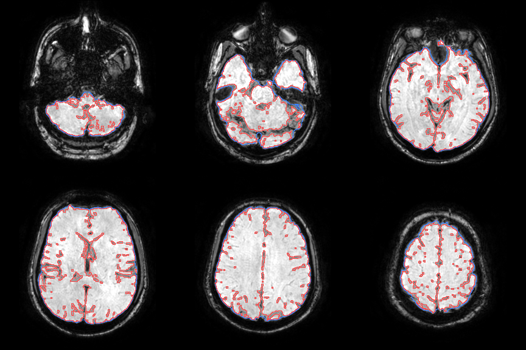

Blue is the closed envelope, red is the final surface. The contour tracks the
brain tightly through the temporal lobes and cerebellum, which is where
threshold methods usually fail.

The result came out at **1348 cm³** for the envelope — a plausible adult brain
volume, which was the first sign the approach was sound.

## Step 3 — Carving the sulci back open

The envelope from step 2 is a smooth bag. It bridges over every sulcus, so the
mesh looked like a peeled potato — recognisably a brain, but bald.

The fix exploits the same contrast again: **CSF is dark on SWI**, and every
sulcus is full of CSF. So re-thresholding *inside* the envelope carves the
folds back open.

Picking the threshold mattered. I swept it and looked at each result:

| Cut | Volume | Result |
|---|---|---|
| p8 | 1241 cm³ | still bald |
| p10 | 1214 cm³ | faint relief |
| **p13** | **1173 cm³** | **real gyri, surface intact** |
| p16 | 1132 cm³ | good relief, cortex thinning |
| p20 | 1078 cm³ | breaking into disconnected crumbs |

I settled on the 13th percentile of intensity inside the envelope — expressed
as a percentile rather than a fixed number so it adapts to scan brightness.

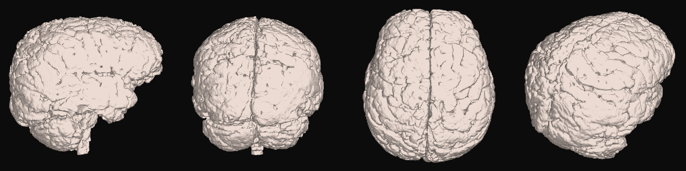

One thing that cost me an hour: I originally followed the threshold with
`binary_closing` and `fill_holes` out of habit. Both of them reseal the sulci
the threshold has just opened, and the volume barely changed — 2.61 M voxels
against 2.63 M. The mask looked right in every summary statistic and completely
wrong in the render. There is a comment in the code now saying not to add them
back.

## Step 4 — The arterial tree

Time-of-flight angiography makes flowing blood far brighter than stationary
tissue, so a high percentile threshold gets the arteries immediately. It also
gets subcutaneous fat, which is just as bright.


The small bright dots deep in the neck are the real arteries. Everything
tracing the outline of the neck is fat. Three filters separate them, in
`pipeline/02_arteries.py`:

**Depth under the skin.** Fat sits in a shallow rim; the carotids and
vertebrals run 25–40 mm deep. I build a solid body silhouette and compute a
distance transform from the air, then require 14 mm of depth.

This one took two attempts. My first body mask was a plain tissue threshold,
which is speckled — muscle and bone fall below the cut and leave dark channels
running out to the air, which destroys the distance transform. Only 1.7 M of
19 M voxels came back as "deep", and the filter deleted the arteries along with
the fat. Smoothing hard *before* thresholding makes the interior solid and
fixes it.


**Elongation.** PCA on each component's voxel cloud: a tube puts nearly all its
variance on one axis.

**Flatness.** A slab of fat is elongated too, just along *two* axes. Requiring
the second principal axis to be under 16% of the first is what finally removed
the last stubborn clumps.

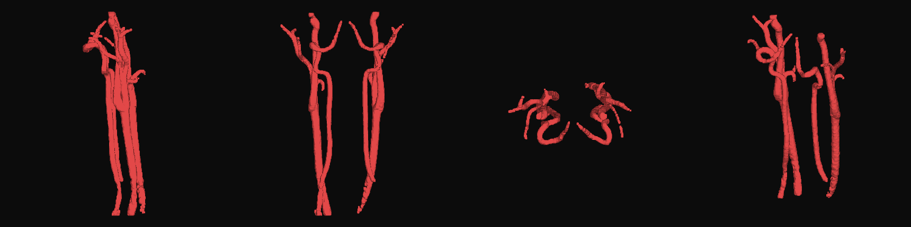

Both common carotids with their bifurcations into internal and external
branches, both carotid siphons curving at the skull base, and both vertebral
arteries. 10.2 cm³ of vessel.

## Step 5 — Two studies, two coordinate frames

The brain comes from the 12:16 study and the arteries from the 09:11 study.
Three hours apart means I got off the table and was repositioned, so identical
scanner coordinates do **not** mean identical anatomy. Rendered together in raw
scanner space, the carotid siphons floated centimetres from the skull base they
are supposed to hug.

`pipeline/02b_align_arteries.py` rigidly registers the angiogram onto the SWI
with ANTs, restricted to the slab where the two overlap so the non-shared neck
and vertex can't drag the fit off.

The second problem was the output grid. Warping straight into the SWI grid
cropped the carotids at the edge of the head field of view and threw away most
of their length — 58 k voxels down to 14 k. I now build a union grid: SWI
orientation, so the arteries land in the brain's anatomical frame, but extended
to cover the angiogram's full reach down the neck.

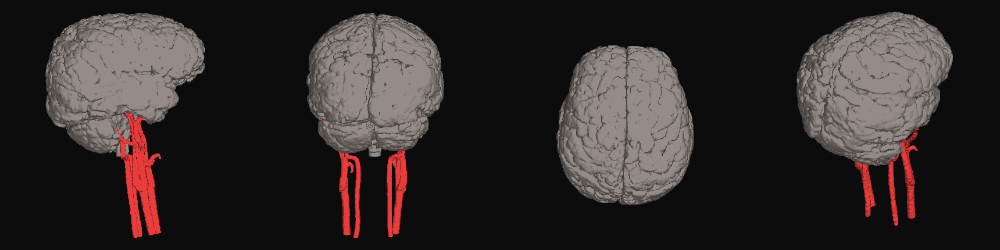

## Step 6 — The head

Neither series covers a whole head. The SWI is 233 mm wide but its field of
view cuts straight through the face. The sagittal T1 has the entire face
profile and chin but is only 144 mm across — 27 slices at 5.3 mm.

Since both come from the same session they already share a coordinate frame, so
`pipeline/03_head.py` simply unions the two silhouettes. The SWI supplies the
width and the vault, the sagittal T1 supplies the face.

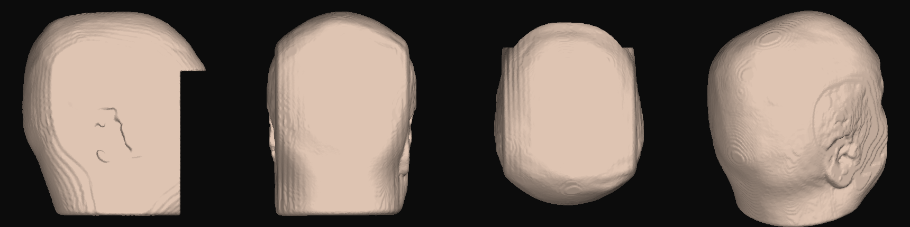

The head model is **defaced** by default — everything in front of the frontal
lobe and below eye level is flattened away. A 3D face reconstructed from MRI is
biometric data and can be matched against a photograph, so the unmodified
version is opt-in via `--keep-face`, writes only into the git-ignored `build/`
directory, and is never exported to a mesh.

## Step 7 — Naming every part

This is the step that turns a blob into something you can learn from.

I warp the **Harvard-Oxford atlases** onto my scan with ANTs SyN registration
and let the labels come along. Doing it this way means every named region
traces back to a published atlas rather than to a boundary I invented.

The registration is cross-modality — the atlas template is T1-weighted and my
scan is SWI — so it is driven by mutual information on brain-extracted volumes.

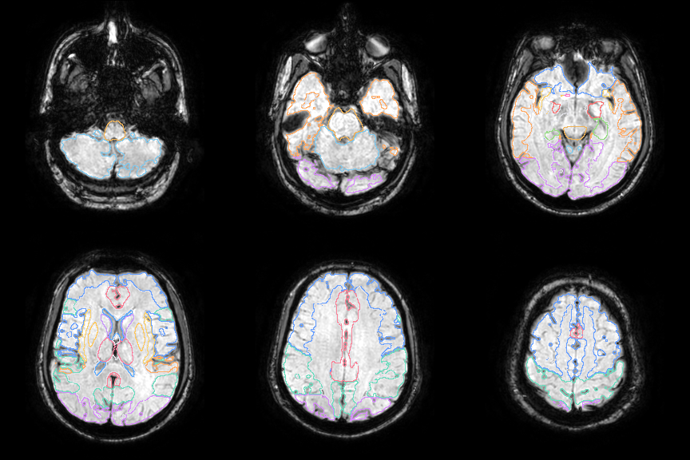

The ventricles, thalamus, caudate, putamen, hippocampus and brainstem contours
all land on the real structures, which is the check that matters.

**The cortex problem.** My first version used only the subcortical atlas, and
the result covered a small fraction of the brain — the entire cerebral cortex
was unlabelled, which is most of it. Harvard-Oxford splits into two atlases and
I had only warped one.

The second version warps the cortical atlas as well: 48 regions, which I group
into anatomical lobes with an ordered set of matching rules. Order matters —
"Temporal Occipital Fusiform Cortex" has to be matched before the plain
"occipital" rule or it lands in the wrong lobe. The script prints any label it
fails to assign, which is how I caught "Parietal Opercular Cortex" slipping
through on the first run.

**The cerebellum** has no Harvard-Oxford label at all. I derive it as the one
large unlabelled blob left inside the brain mask once everything else is
accounted for, eroding first to drop the thin unlabelled CSF rim that hugs the
whole surface.

Final tally — twenty parts, **95.4% of the brain by volume**:

| Group | Structures |
|---|---|
| Cortex by lobe | frontal, parietal, temporal, occipital, cingulate, insula |
| Inside | white matter, cerebellum, brainstem, ventricles, thalamus, caudate, putamen, pallidum, hippocampus, amygdala, accumbens |
| Other | whole cortical surface, arteries, head |

Volumes land in normal adult ranges — brain 1173 cm³, white matter 295 cm³,
cerebellum 106 cm³, ventricles 11.1 cm³, brainstem 27.9 cm³.

## Step 8 — Baking the light in

A single-colour organic surface renders flat. Screen-space ambient occlusion
would fix it but costs a postprocessing pass and several more dependencies.

Instead I compute ambient occlusion **from the volume itself** and bake it into
vertex colours. Blur the binary mask, then sample it at each vertex: deep in a
sulcus you are walled in on all sides so the blurred occupancy is high; on a
gyral crown it is low. That maps directly onto how dark the crevice should be,
costs one convolution, and needs nothing at runtime beyond `COLOR_0`.

This is the single change that made the model look like tissue rather than
plastic.

`pipeline/05_export.py` then smooths each mask with Taubin lambda/mu smoothing
(which avoids the shrinkage plain Laplacian smoothing causes — that would
visibly thin the gyri), decimates to a triangle budget, and writes GLB.

One coordinate detail worth stating: scanner space is RAS and glTF is Y-up, so
vertices are mapped `(x, y, z) → (x, z, −y)`. That is a right-handed transform,
determinant +1. A left-handed mapping would silently mirror the model and swap
my left and right hemispheres, which is exactly the kind of error nobody
notices until it matters.

## The viewer

`web/` is a three.js application with no build step and no CDN — three.js and
three-mesh-bvh are vendored into `web/vendor/`, so it runs fully offline.

### Two modes

**Minimal** is the default: the model, a centred bar and the compass. Nothing
else. Click any structure and a leader line runs out from the exact point you
clicked to a card explaining what it is.

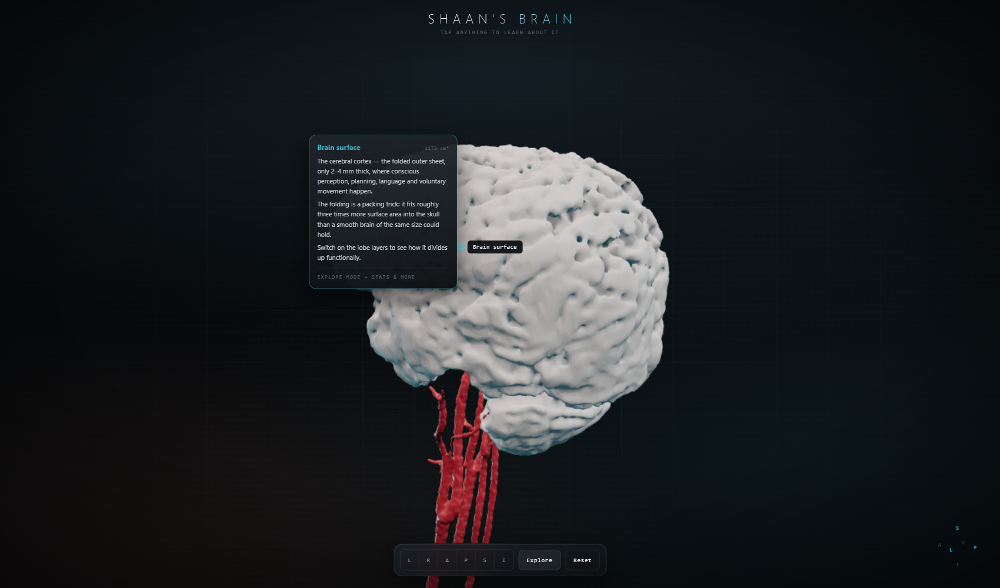

**Explore** brings in a symmetric pair of panels — layers on the left, detail
on the right — so the layout stays balanced. In this mode the callout shrinks
to a label on the end of the leader, because repeating the text over the model
just covers it.

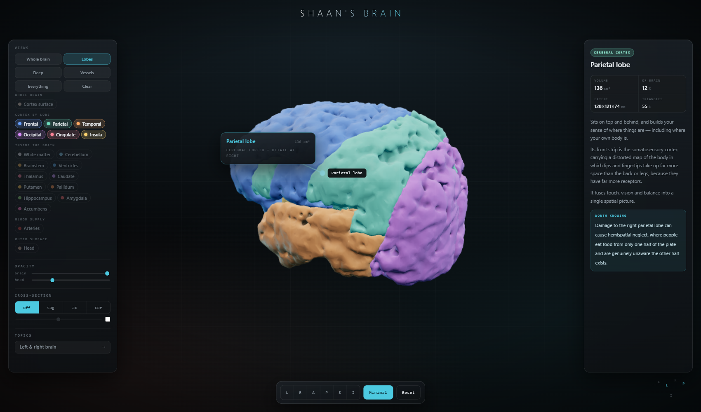

The right-hand panel carries the full detail: the anatomical system it belongs
to, volume, its share of total brain volume, physical extent in millimetres,
triangle count, what it does, and something worth knowing about it.


Layers are **chips, not switches**. Click to toggle, double-click to isolate,
hover to highlight in 3D. Above them a Views row sets whole scenes in one
click — arranging twenty chips by hand to reach a sensible view is tedious and
the useful combinations are predictable. *Deep* also fades the cortex
automatically and deliberately excludes white matter, because white matter is a
large opaque shell wrapping exactly the nuclei that view exists to show.

There is a cross-section that cuts a sagittal, axial or coronal plane through
everything at once:

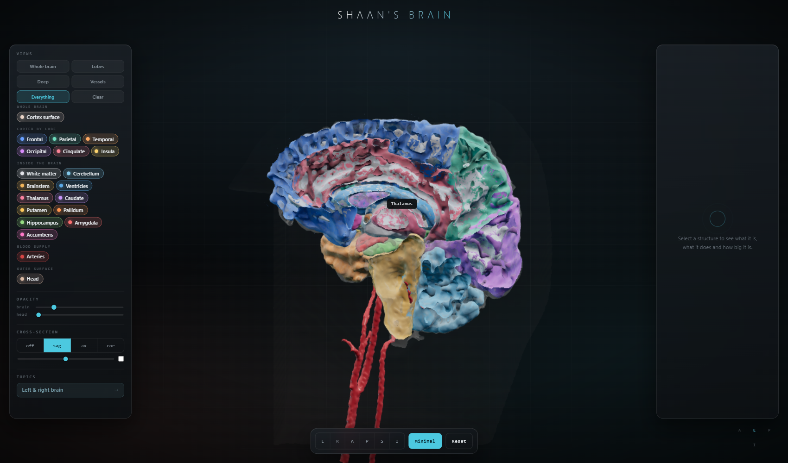

And a topic card on hemispheric specialisation, which covers contralateral
control, language lateralisation and the corpus callosum — and explicitly flags
the "left-brained / right-brained personality" idea as unsupported, since that
is the version most people have heard:

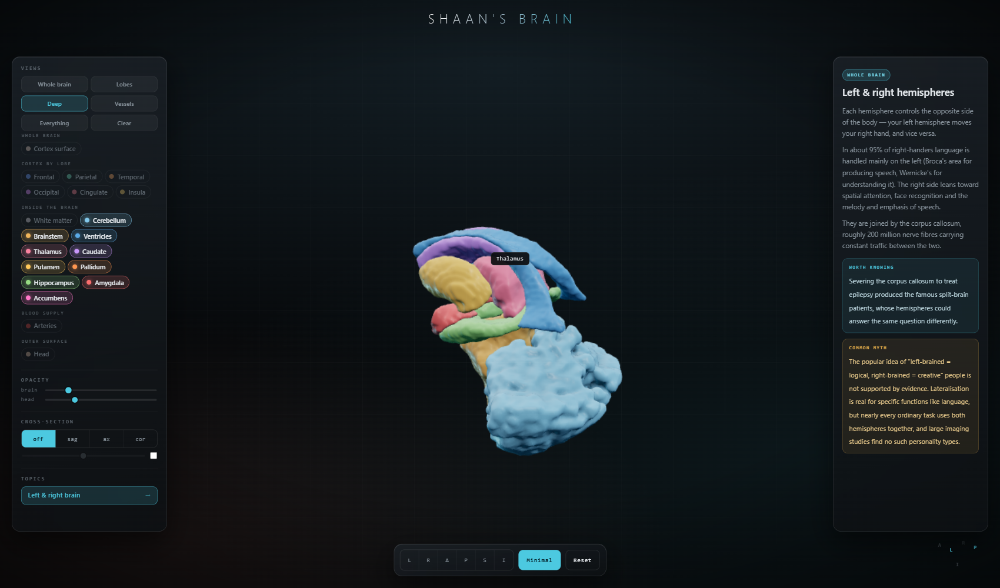

Other things it does: fly the camera right inside the brain (`minDistance` is
0.6 mm), double-click a structure to focus it, anatomical preset views, an
orientation compass, and a slow auto-orbit after five seconds idle.

### Mobile

The panels become bottom sheets that sit above the bar, one at a time. Touch
targets go to 38 px. The bar tightens — six view buttons plus three controls
overflowed a 390 px screen and became literally unreachable, so the segment
shrinks and Reset collapses to its glyph.

The leader-line callout is replaced by a docked card, because a floating card
tethered to a line is unreadable at that size. On mobile that card is the only
detail surface, so it carries everything: description, stats and the fact. The
camera also frames wider on phones so the model clears the card.

<p align="center">
  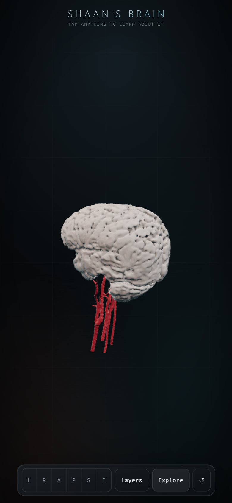
  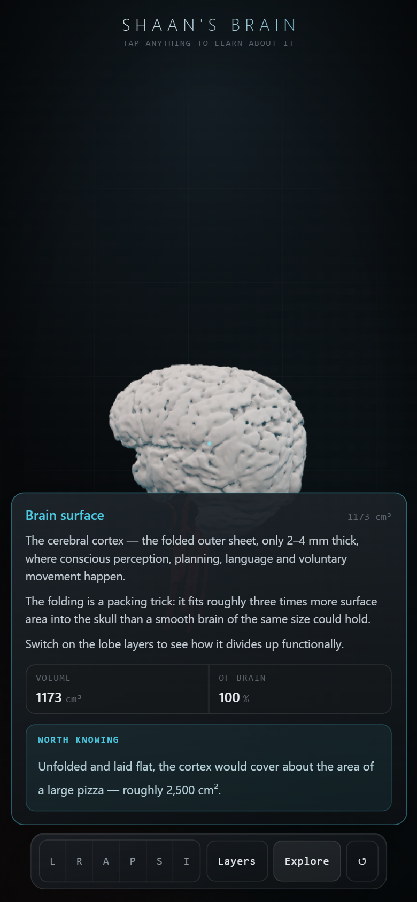
  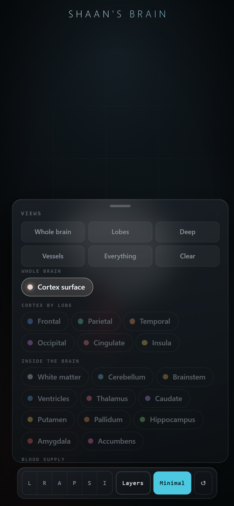
</p>

## Performance

`npm run bench` drives the viewer with a real GPU and reports frame times, draw
calls and picking cost. Measured on an AMD Radeon integrated GPU at 1600 × 950:

| Scene | Before | After |
|---|---|---|
| Brain only | 59.9 fps | 59.9 fps (vsync cap) |
| Default | 59.9 fps | 59.9 fps (vsync cap) |
| Lobes | — | 59.9 fps |
| Deep | — | 59.9 fps |
| Everything on | 28.6 fps | **59.9 fps** |
| Everything, close-up | 14.5 fps | **48.3 fps** |
| Raycast per pick | 43.4 ms | **0.427 ms** |

"After" is measured with twenty parts and 1.4 M triangles on screen, roughly
double the geometry of the "before" column. **No triangles were removed.**

What actually mattered:

**Picking was the worst offender by a distance.** Hover raycasting was
brute-force testing every triangle of every visible mesh on every
`pointermove` — 1.3 M triangles, 43 ms per event, on an input that fires faster
than the screen refreshes. A BVH made it ~100× faster. Raycasts are now also
coalesced to one per frame and skipped entirely mid-drag.

**Everything was permanently flagged `transparent`,** even at full opacity.
That put all the nested shells into the sorted blend pass with no early-Z
rejection. Opaque parts now render opaque, which is what halved draw calls.

**Clearcoat and sheen are dropped below 50% opacity.** A second specular lobe
you cannot see through a 22%-opaque surface is pure cost. The scalp — a
full-screen near-transparent shell, the most expensive thing on screen in the
close-up case — dropped to `MeshStandardMaterial` entirely.

**Adaptive resolution** as a backstop: framebuffer scale steps down when frame
time stays above 24 ms and recovers when it drops. Pixels only, never geometry.

## Problems I hit

Beyond the ones described in context above, four were interesting enough to
write down.

### The cortex went hollow

I switched materials to `FrontSide` so the GPU could cull backfaces. It
benchmarked beautifully — 60 fps with everything on, 42 close-up. It also did
this:

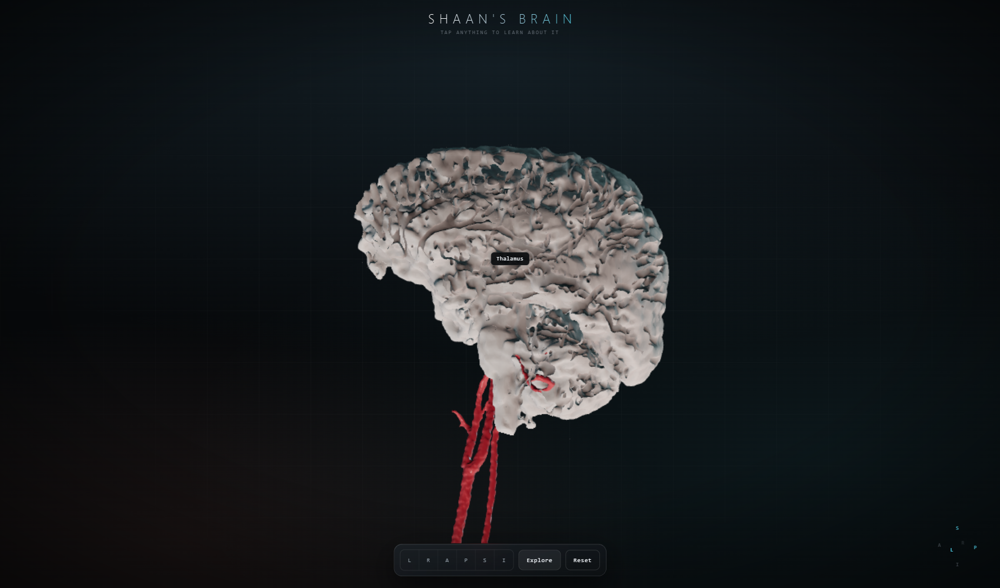

These meshes come from marching cubes on a **non-watertight** mask and their
triangle winding is mixed. Culling deleted every inward-wound face, punching
holes straight through the surface. Measuring it afterwards: the head is 99%
correctly wound and watertight, and rendered fine; the brain is neither.
`trimesh.fix_normals()` changes nothing, because it cannot orient a mesh that
isn't watertight.

`side` is pinned to `DoubleSide` with a comment explaining why. Making the
meshes watertight and consistently oriented in the pipeline would unlock this
properly — and would also make them printable, since watertightness is exactly
what slicers require.

### Everything rendered as a black silhouette

The geometry loaded, the shape was right, and every mesh was pure black. The
GLBs had no `NORMAL` attribute, so every lit material had nothing to shade
with. Fixed at both ends: `include_normals=True` on export, and a
`computeVertexNormals()` fallback on load.

### The leader lines were invisible

My first callout pushed the label away from the surface **along the surface
normal**. That reads correctly in profile and collapses to exactly zero screen
length whenever the normal happens to face the camera — which is most of the
time, because you tend to click what is pointing at you. The leader is now
routed in screen space, so it always has visible extent whichever way the model
is turned.

### Evans' index, three wrong answers

Evans' index — maximum frontal-horn width over maximum internal skull
diameter — is a single caliper measurement a radiologist makes on one chosen
slice. Automating it produced three confidently wrong numbers before I got one
I trusted:

1. **0.325.** Ventricles segmented from SWI on a "dark = CSF" rule. Wrong: on
   SWI, veins are the darkest structures in the brain, so it traced vessels and
   sulci.
2. **0.607.** Ventricles from T2 (where CSF is unambiguous), but maximising the
   *ratio* across slices — which just finds a slice where the denominator is
   degenerate. It reported 7.9 mm frontal horns in a 13.1 mm skull.
3. **0.313.** Slice chosen by maximum frontal-horn width, denominator taken
   globally. Better, but the "frontal horns" it found were in the posterior
   fossa: it had measured the fourth ventricle.
4. **0.194.** Atlas restricted to the *lateral* ventricles specifically, T2
   intensity for the boundary, frontal horns taken as the anterior 45% of their
   own extent.

Each of the first three would have read as a plausible finding. The only reason
I caught them was rendering the exact slice the measurement came from and
looking at it. That is the whole lesson: an automated number from a clinical
scan is worth nothing without a picture of what it measured.

## Running it

```bash
npm install     # three.js and three-mesh-bvh
npm run serve   # http://localhost:8080
```

It has to be served over http — ES modules and `fetch()` do not work from
`file://`.

**Controls:** drag to orbit, scroll to zoom, click a structure to read about
it, double-click to focus it, `E` toggles Explore mode, `Esc` clears.

### Rebuilding from the scan

The DICOM is deliberately not in this repo. Point the scripts at a folder of
`dcm2niix` output and run them in order:

```bash
python pipeline/01_brain.py            # brain mask + cortical surface
python pipeline/02_arteries.py         # arterial tree from the angiogram
python pipeline/02b_align_arteries.py  # register the angiogram onto the brain
python pipeline/03_head.py             # head surface (--keep-face to skip defacing)
python pipeline/04_deep.py             # atlas registration -> named structures
python pipeline/05_export.py           # AO bake, decimate, write GLB + manifest
```

Requires `numpy scipy scikit-image nibabel trimesh fast-simplification antspyx nilearn`.

Every script writes a QC image into `build/`. Look at those, not just the
console output — most of the mistakes above produced perfectly reasonable
numbers and obviously wrong pictures. `04_deep.py` caches its registration;
pass `--force` to redo it.

## What the numbers mean

Not every part of this is the same kind of measurement, and the difference
matters when reading the volumes.

**Measured from the scan.** The brain surface, the arteries and the head. Every
vertex traces back to voxel intensities in the DICOM.

**Positioned from the scan, shaped by an atlas.** The lobes, white matter and
all the deep nuclei. These are Harvard-Oxford structures elastically warped
onto my anatomy: their *location* is inferred from my scan, their *shape* is
substantially inherited from the template. The volumes shown for them are
closer to "the atlas's structure after warping" than to an independent
measurement of me. Lobe boundaries in particular are a convention, not a
visible feature of the tissue.

**Derived by subtraction.** The cerebellum is whatever the atlases did not
label. At 105.9 cm³ against a normal 120–160 cm³ it is probably
under-segmented.

**Chosen, not measured.** Every colour, and the smoothing. Taubin smoothing and
the pre-mesh blur genuinely move the surface, so this is a smoothed likeness,
not a millimetre-exact cast.

The brain volume is also threshold-dependent: it moves between 1078 and
1241 cm³ across reasonable choices of the cortical cut, which is worth
remembering before comparing it to anything.
