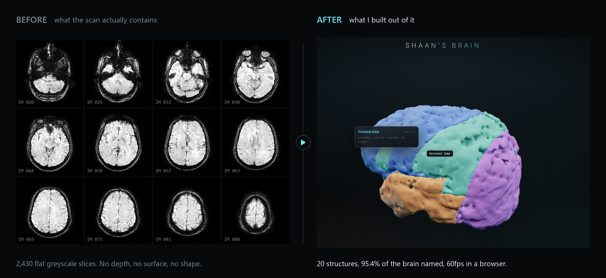
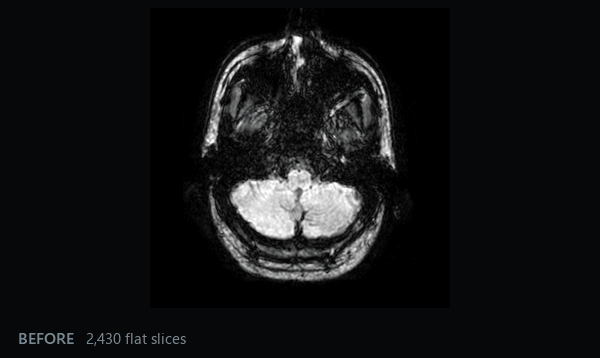
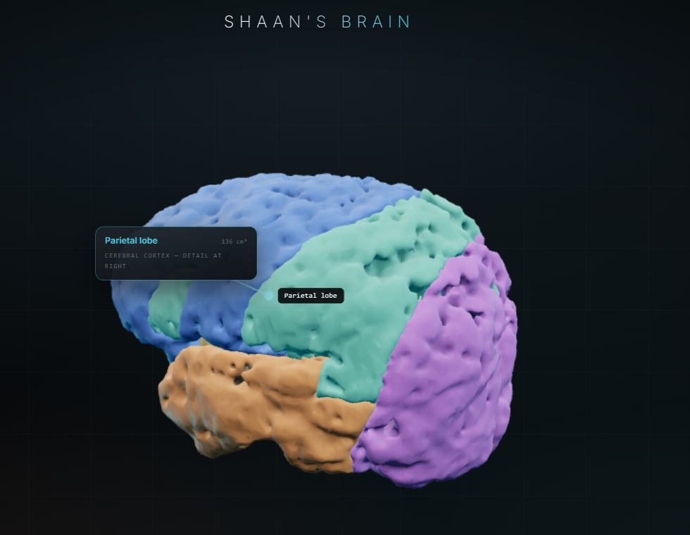

# Share kit

Everything needed to post the project somewhere, in one place. Plain text in
[`message.txt`](message.txt) if you just want to copy and paste.

## Images

**Before and after.** The strongest single asset, because it shows the problem
and the result side by side. Raw slices generated from the source SWI volume,
not a stock image.

**Animated version.** Scrolls through 26 real axial slices, then dissolves into
the rotating model. The dissolve is the whole argument in about a second,
because you watch a flat grey slice turn into something you can rotate. 600x358,
2.9 MB, 6.9 seconds.

**Single hero shot.** For anywhere a comparison is too busy. Cropped square so
it does not letterbox into an unreadable strip in a chat window.

## Message

Version A, 994 characters. WhatsApp caps captions at 1024, so this attaches to
the image as a single message.

> \*I put a 3D model of my own brain online. It's at brain.aihq.in\*
>
> You can spin it around, tap any part to read what that part does, peel it back
> to the lobes or the deep structures or just the arteries, and cut a cross
> section through it at any angle. It works on a phone.
>
> The brain in it is mine. I had an MRI done in 2023, the disc sat in a drawer
> for two years, and I opened it out of curiosity.
>
> An MRI gives you a stack of flat photographs taken a fraction of a millimetre
> apart, 2,430 of them in my case. Getting from that to a shape you can hold
> means deciding, at every point in the stack, whether it's brain or bone or
> vessel or nothing at all. Where the scan is bright or blurry or ambiguous,
> that call is yours and easy to get wrong. Most of my time went there.
>
> Came out at 1,173 cm³ of brain in 20 named structures, running at 60fps in a
> browser.
>
> Wrote up how I did it at brain.aihq.in/docs, and the code is at
> github.com/Shaan-kapoor/brain
>
> Would be glad to hear what you think.

Shorter cuts at 710 and 289 characters are in [`message.txt`](message.txt).

The single asterisks are WhatsApp bold syntax, so copy them literally. With an
image attached WhatsApp will not render a link preview card, so send the short
version as text on its own if the big clickable preview matters more than the
picture.

## Numbers used

Every figure in the copy comes from the pipeline, not from rounding for effect.

| Figure | Meaning |
|---|---|
| 2,430 | DICOM files across both studies |
| 20 | structures exported as separate meshes |
| 95.4% | of the brain surface assigned to a named region |
| 1,173 cm³ | measured brain volume |
| 60fps | with every layer switched on |
